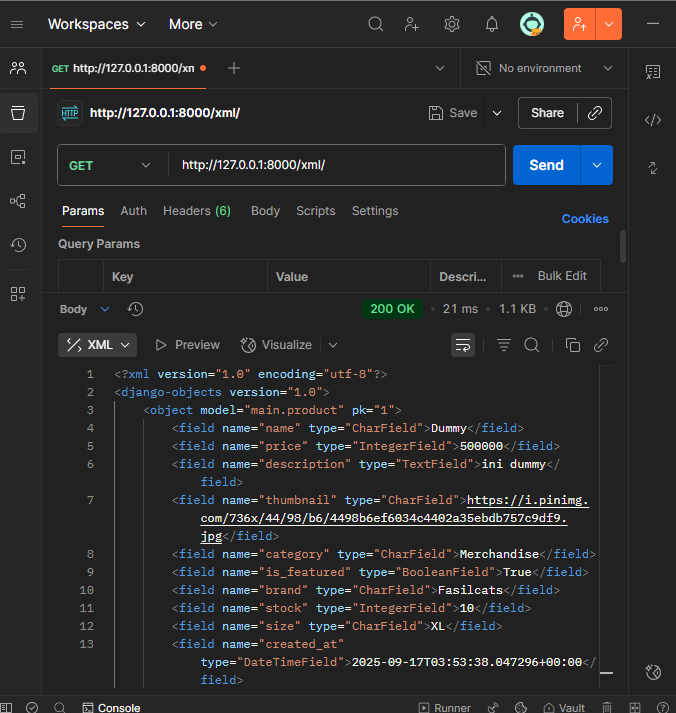
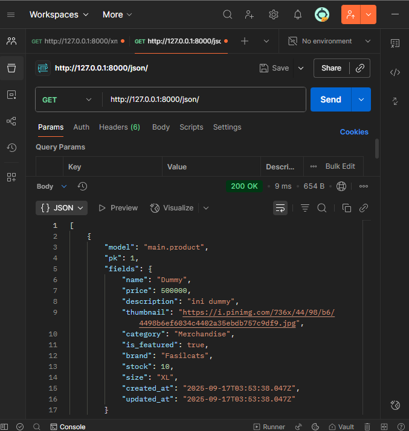
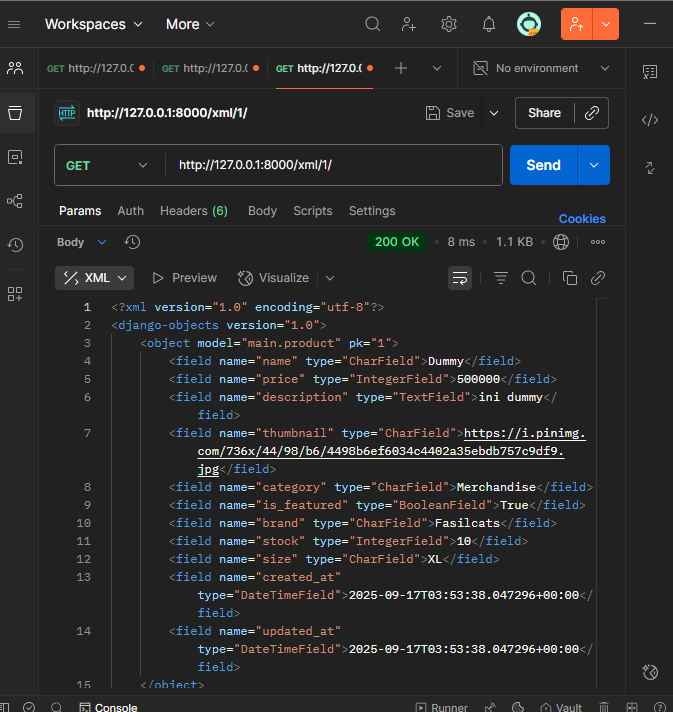
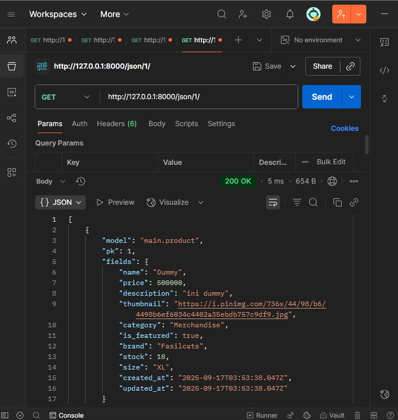

## Jawaban Pertanyaan

### 1. Jelaskan mengapa kita memerlukan *data delivery* dalam pengimplementasian sebuah platform?

Data delivery diperlukan dalam pengembangan platform sebagai integrasi sistem antar platform dari berbagai komponen untuk dan bertukar data, akses data yang fleksibel, menyediakan data secara real-time, juga memisahkan data delivery dari presentation layer yang memungkinkan sistem lebih scalable.

### 2. Menurutmu, mana yang lebih baik antara XML dan JSON? Mengapa JSON lebih populer dibandingkan XML?

**JSON:**
lebih ringkas, mudah dibaca manusia, langsung cocok dengan struktur data pada bahasa pemrograman modern (dictionary di Python, object di JavaScript), parsing lebih cepat. Namun tidak punya dukungan metadata sekuat XML.

**XML:**
lebih fleksibel, bisa menyimpan data dengan struktur hierarki yang kompleks, mendukung metadata melalui atribut, dan sering dipakai pada sistem lama (legacy system). Namun lebih verbose yang menjadikan ukuran file lebih besar, dan parsing lebih berat.

JSON lebih populer karena ringan, mudah dibaca, performa dan kompatibilitas proses yang baik, dan lebih mudah diintegrasikan dengan API maupun JavaScript dengan teknologi web modern. Itulah sebabnya JSON lebih populer dibandingkan XML dalam pengembangan web dan aplikasi masa kini.

### 3. Jelaskan fungsi dari method `is_valid()` pada form Django dan mengapa kita membutuhkan method tersebut?

is_valid() digunakan untuk memeriksa apakah data yang dimasukkan ke dalam form sesuai dengan kriteria validasi yang sudah ditentukan di model/form. Jika valid, form bisa disimpan ke database menggunakan save(). Jika tidak valid, Django otomatis memberi error message.

### 4. Mengapa kita membutuhkan `csrf_token` saat membuat form di Django?

csrf_token adalah token unik yang mencegah serangan Cross-Site Request Forgery (CSRF). kita membutuhkan ini untuk mencegah website jahat mengirim request atas nama user yang sedang login, memastikan request benar-benar berasal dari form di website kita, dan memverifikasi bahwa request dibuat oleh user yang sah.

Tanpa token ini, penyerang bisa mengirimkan request palsu ke server seolah-olah berasal dari pengguna yang sah (misalnya mengirim form transfer uang tanpa sepengetahuan user). Dengan adanya csrf_token, hanya form yang berasal dari website kita yang akan diterima server.

### 5. Jelaskan bagaimana cara kamu mengimplementasikan checklist di atas secara step-by-step

**Step 1: Membuat Model dan Form**
Membuat `ProductForm` di `forms.py menggunakan ModelForm

**Step 2: Implementasi Views**
- Membuat fungsi `show_xml()`, `show_json()`, `show_xml_by_id()`, `show_json_by_id()` di `views.py`
- Menggunakan `serializers.serialize()` untuk konversi data
- Membuat fungsi `create_product()` untuk handle form dan fungsi `product_detail()` untuk detail produk

**Step 3: URL Routing**
Menambahkan routing URL patterns di `main/urls.py` untuk semua views

**Step 4: HTML**
Membuat `create_product.html` form dan `product_detail.html` untuk menampilkan detail produk kemudian update `main.html` dengan tombol Add dan Detail pada setiap product card

**Step 5: Testing**
Menjalankan server dengan `python manage.py runserver` dan melakukan testing pada fungsi add dan detail baru.

### 6. Feedback untuk Asdos Tutorial 2

Tutorial 2 sudah cukup jelas dalam menjelaskan konsep dasar Django. Beberapa saran mungkin ditambah contoh contoh.

## Screenshots Postman

